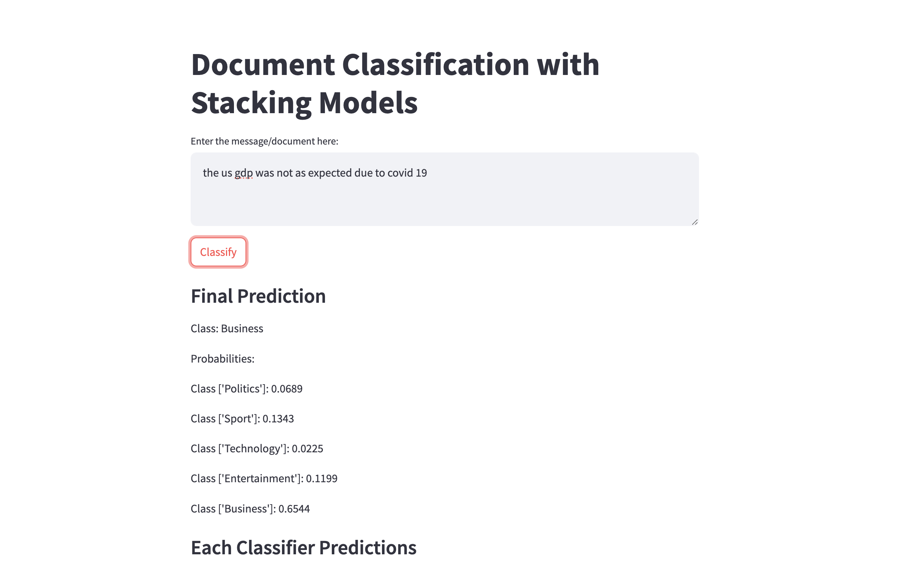

### README

#### Optimized Document Classification with Stacking Models
LLMs impressive performance comes with high computational costs and reliance on GPUs, making them costly to deploy—especially for document classification tasks. In this repo, I wanted to demonstrate that classical machine learning models, especially with efficient preprocessing, can achieve comparable performance to LLMs in document classification while being significantly faster and yet much more cost effective.

### Key Features

- **Simple Preprocessing**: straightforward preprocessing (including stemming, lowercasing, removing stop words).

- **Cost-Effective**: No need for GPUs. It can run on CPU with high speed and low cost. 
- **Competitive Performance**: Comparable performance with LLMs in document classification.
- **Classical ML Models**: Utilizes models like SVM, Random Forest, and XGBoost, followed by a linear layer for final classification.


Note: This is just a demo on a public dataset. You can leverage the same approach on your own dataset!

| Precision | Recall | F1-Score |
|-----------|--------|----------|
| 0.99      | 1.00   | 0.99     |


#### Installation
The required dependencies via pip:

```bash
pip install -r requirements.txt
```

### Data Source

The dataset used in this project is included in this repository. If you'd like to download the data directly, you can find it on Kaggle:

[**Text Document Classification Dataset**](https://www.kaggle.com/datasets/sunilthite/text-document-classification-dataset).


#### How to run
To generate the data from raw text files run `generate_dataset.py`. (the datasetes are ready in data folder, so you don't necessary this)
To train the model run `main.py`,

```bash
python main.py
```

#### Files and Directories
- `data/`: Contains the dataset files.
- `resources/`: Resources like models/encoder/ tf idf vectorizer.
- `supp/`: Supplementary files and images (in notebook) that used in presentation
- `api_call.ipynb`: a simple jupyter notebook for API calls.
- `app.py`: API server code that a user can make http calls to get answer (python app.py) it uses port 5001
- `generate_dataset.py`: generating train/test datasets.
- `interactive_api.py`: Streamlit api (how to run: streamlit run interactive_api.py --server.port 2323)
- `main.py`: script for training.


#### API Server
make sure the API server is running. The API is `http://127.0.0.1:5001/predict`.

1. **Prepare the Data**:
   Load the message (here is an example using test dataset):
   ```python
   import pandas as pd
   df_test = pd.read_csv("data/test_dataset.csv")
   messages = df_test["message"].tolist()
   url = 'http://127.0.0.1:5001/predict'
   data = {'messages': messages}
   response = requests.post(url, json=data)
   ```

2. **Process the Response**:
   get the predictions and probabilities from the response. you can also get probability and prediction for each class in the stack individually, see `api_call.ipynb`:
   ```python
   response_data = response.json()
   predictions = response_data['predictions']
   probabilities = response_data['probabilities']
   ```

#### Streamlit
Streamlit api (how to run: streamlit run interactive_api.py --server.port 2323)

